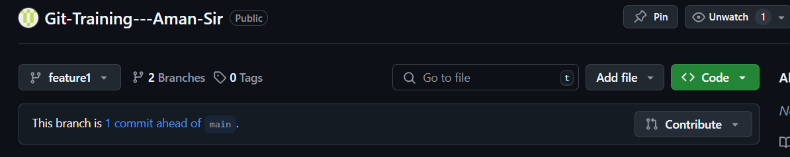

# Basic Github

#### We learn to create Token, add credentials 
Learn to creating repo, clone the repo and use commands for commit the changes, push into the repo.  

# Invetyv Branching Demo  

#### There is one main branch intiality called 'prod' branch too

Then we create other three branches called alpha, beta and devlopment branch.

```bash
    git branch alpha
    git branch beta
    git branch dev
```

#### Then We can change the branch by using the command chekcout and commit the changes in that particular branch

```bash
    git checkout dev
    git commit -m "commit in dev"
```

Similarly I can perform the changes in all three branches

#### After that we need to make one new feature and we need to merge that feature in the prod and for that first we need to pull the latest data from the prod and apply change in that and that is called feature1  

```bash
    git branch feature1
    git commit -m "changes in feature1"
```

#### Then we perform quick hotfix in main (prod) branch and then we merge the feature1 in the prod 

```bash
    git checkout main
    git commit -m "hotfix"
    git merge feature1
```

## Visulization of this workflow:


# Git Pull Request

A pull request, often abbreviated as PR, serves as a proposal to merge changes made in one branch of a repository into another, typically from a feature branch into the main branch.

## We can create two branches

```bash
    git branch feature1
    git add f2.txt
    git push origin feature1
```
## We can add branch protection rule to feature branch:


## Then if the push req has occur from the feature branch then pull request acceptance is shown to the owner:


## Owner can see this:


## Owner can create pull request:


## Files Changing status


## Merge PR 
